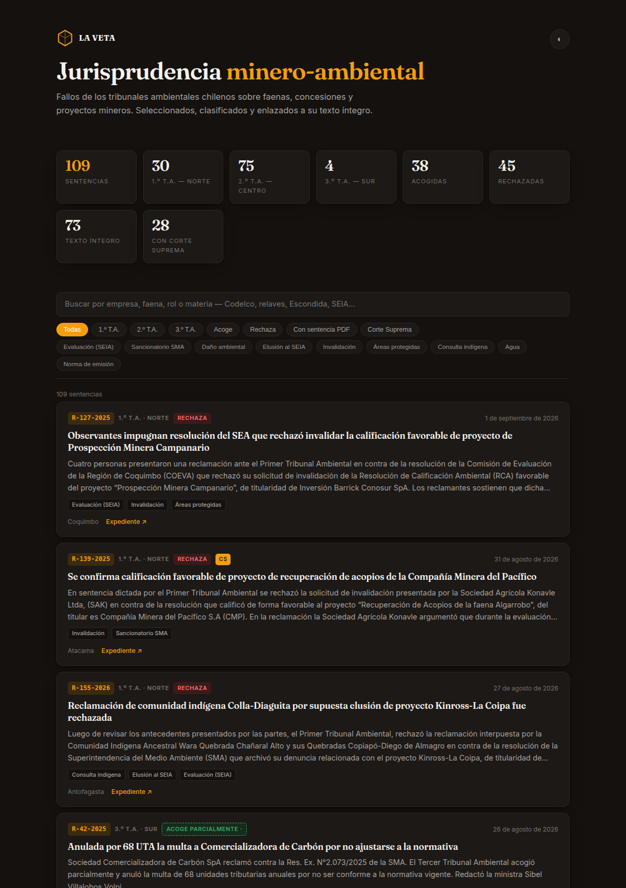

# La Veta — jurisprudencia minero-ambiental chilena

Ingesta, clasifica, indexa y publica las sentencias de los tres tribunales
ambientales de Chile sobre faenas, concesiones y proyectos mineros.
**109 fallos, todos con doctrina y resumen redactados.**



| | |
|---|---|
| Fuentes | 1.º T.A. Antofagasta · 2.º T.A. Santiago · 3.º T.A. Valdivia |
| Base | 745 sentencias, 109 clasificadas como mineras |
| Salida | una página HTML autocontenida, con buscador y filtros, sin dependencias |
| Coste | **cero**: ni API de pago ni servicios externos |
| Pruebas | 90, incluidas las que miden la precisión de las heurísticas |

Mismo modelo de producto que [La Quinta Sala](https://laquintasala.cl) —boletín
de jurisprudencia por suscripción—, resuelto en Python y sin modelo de lenguaje
en el camino.

## Tres problemas que hubo que resolver

**La fuente de la Corte Suprema está cerrada.** `juris.pjud.cl` tiene
`Disallow: /` para todo agente y su buscador va tras reCAPTCHA. En vez de
forzarlo, el proyecto se apoya en los tribunales ambientales, que publican
abierto — y recupera rastro de la Corte por la puerta lateral: 28 de las 109
causas llevan el rol de casación o el fallo completo anexado al PDF del tribunal.

**Cada tribunal publica una cosa distinta.** El 1.º T.A. redacta titular y
resumen en su sala de prensa; el 2.º publica el resultado y el PDF; el 3.º es el
único que dice quién redactó el fallo, pero no cómo se resolvió. Ese último dato
se deduce de la parte resolutiva con un **98 % de acierto**, medido contra los
50 casos donde el 2.º T.A. sí lo publica — y se muestra marcado como inferido,
nunca mezclado con el dato oficial.

**Los fallos anteriores a 2019 son imágenes escaneadas.** Se rescatan con OCR,
pero pasar las 140 páginas de cada uno a 200 ppp toma diez minutos por sentencia.
Rasterizar solo las puntas —doce páginas del principio y ocho del final, donde
viven los VISTOS y lo resolutivo— lo baja a 51 segundos sin perder nada útil.

## Todo de una vez

```bash
./flujo.sh
```

Tarda ~5 min la primera vez (descarga PDFs) y ~30 s las siguientes.
Salida: `publico/veta.html` (el boletín) y `publico/reporte-*.html` (imprimible a PDF).

## Paso a paso

```bash
python3 cli.py ingestar --fuente 1ta   # Primer T.A. (Antofagasta): el norte minero
python3 cli.py ingestar --fuente 2ta   # Segundo T.A. (Santiago)
python3 cli.py clasificar              # marca lo minero
python3 cli.py indexar                 # normas citadas, artículos, sub-materia
python3 cli.py bajar --minero --n 120  # descarga los PDF de las mineras
python3 cli.py extraer                 # PDF -> texto
python3 cli.py ocr --minero --n 40     # rescata los escaneados (2013-2019)
python3 cli.py preparar --auto         # titular desde la tabla de contenidos
python3 cli.py veta                    # publica el boletín
python3 cli.py reportar --dias 7       # reporte del periodo
```

Cada paso es idempotente: se puede cortar y retomar sin duplicar nada.

## Las dos fuentes, y por qué estas

| | Aporta | Cobertura |
|---|---|---|
| **1.º T.A.** Antofagasta (`1ta`) | Titular y resumen **ya redactados por el tribunal** en su sala de prensa | 45% minero |
| **2.º T.A.** Santiago (`2ta`) | Tabla estructurada, resultado publicado y PDF íntegro | 17% minero |
| **3.º T.A.** Valdivia (`3ta`) | **Ministro redactor**, competencia del art. 17 y vídeo de los alegatos | 2% minero |

El 3.º T.A. aporta poco volumen minero —Valdivia es forestal y acuícola— pero es
el único que publica quién redactó cada fallo. A cambio no publica el resultado:
se deduce de la parte resolutiva del PDF (`controversias.resultado`, 98% de
acierto medido contra los 50 casos donde el 2.º T.A. sí lo publica) y se muestra
marcado como inferido, nunca mezclado con el dato oficial.

`juris.pjud.cl` (Corte Suprema) queda fuera: su `robots.txt` es `Disallow: /`
para todo agente y el buscador va tras reCAPTCHA.

## Cómo se redacta el titular, sin pagar

1. **`preparar --auto`** — gratis y determinista. Las sentencias del 2.º T.A. abren
   con una TABLA DE CONTENIDOS donde el propio tribunal enumera las controversias;
   de ahí sale el titular. Las del 1.º T.A. ya vienen con titular escrito.
2. **`preparar` + `cargar`** — vuelca lo pendiente a `pendientes.json`, se redacta
   a mano (o en una sesión de Claude Code, que ya está pagada en la suscripción) y
   se devuelve a la base con `cargar`.
3. **`resumir`** — vía API de pago. Está implementada, pero **no hace falta**.

## Pruebas

```bash
python3 pruebas.py
```

47 pruebas: clasificador minero (18 casos), normalización de PDF, extracción de
la tabla de contenidos, idempotencia del almacén, integridad de la base real y
la página generada (temas, recursos externos, índice de búsqueda).

## Añadir un tribunal

Una función en `boletin/fuentes.py` que rinda dicts con las claves de
`almacen.ESQUEMA`, registrada en `FUENTES`. El 3.º T.A. (Valdivia) es el siguiente.

## Comparación con La Quinta Sala (su reporte N° 47)

Su producto real no es la web: es un dashboard HTML autocontenido, embebido en un
iframe en `/reporte-semanal/`, con 88 sentencias de una semana. Campos: `sala`,
`desc`, `doctrina` (~124 car.), `resumen` (~740 car.), `materia`, `palabras`, `cat`.

| | La Quinta Sala | La Veta |
|---|---|---|
| Sentencias | 88 (una semana) | 109 (2013-2026) |
| Doctrina de una línea | 88/88 | **109/109** |
| Resumen | 88/88 | **109/109** |
| Rol de la causa | **no** | 109 |
| Fecha del fallo | solo el rango semanal | 108 |
| Región | **no** | 95 |
| Enlace a la sentencia | **no** | 73 |
| Enlace al expediente | **no** | 65 |
| Normas citadas | a mano | del texto íntegro (41) |
| Artículos indexados | **no** | 62 |
| Rastro de la Corte Suprema | **no** | 28 |
| Ministro redactor | **no** | 4 (solo 3.º T.A.) |
| Vídeo de los alegatos | **no** | 3 |
| Filtros | sala, resultado | tribunal, resultado, PDF, Corte Suprema, 9 materias |

**Dónde les ganamos: trazabilidad.** Ellos publican doctrina sin rol, sin fecha
individual, sin región y sin enlace al fallo — hay que creerles. Cada ficha nuestra
lleva de vuelta al expediente del tribunal. Y como tenemos el PDF, el índice de
normas sale del texto y no de lo que el editor recordó teclear: se puede preguntar
qué fallos aplican el art. 17 N° 8 de la Ley 20.600 y obtener la respuesta.

**Dónde nos ganan: la profundidad del texto, y quién lo firma.**

La cobertura ya está pareja —109 de 109 con doctrina y resumen redactados leyendo
la parte resolutiva de cada fallo, no sacados de la tabla de contenidos—. Lo que
sigue sin estar parejo es el fondo:

- Sus resúmenes promedian **740 caracteres**; los nuestros, **407**. Casi la mitad.
  Los suyos explican el razonamiento; los nuestros dicen qué se discutió y cómo
  terminó.
- Sus doctrinas promedian 124 caracteres y las nuestras 96, por la misma razón.
- Y la diferencia que ninguna métrica recoge: **las suyas las escribe un abogado.**
  Las nuestras las escribió un modelo leyendo el fallo. Están ancladas al
  resolutivo y no inventan, pero antes de que alguien litigue con esto delante,
  un abogado tiene que revisarlas.

Eso no lo cierra más código. Lo que sí cierra el código es el otro hueco: 36 de
las 109 causas no publican PDF —solo enlace al expediente electrónico—, y por eso
el índice de normas llega a 41 y no a 109.

## PDF escaneados

Los fallos del 2.º T.A. anteriores a ~2019 se publicaron como imagen, sin capa de
texto. `extraer` los detecta y los marca `estado_texto='escaneado'` en vez de
guardar una cadena vacía; `ocr` los rescata con tesseract en español. Es lento
(1-3 s por página), así que va como paso aparte y opcional.

## Dónde quedó (11 de septiembre de 2026)

**109 sentencias mineras, todas con doctrina y resumen redactados.**

| | |
|---|---|
| doctrina + resumen | 109 / 109 |
| texto íntegro | 70 |
| rastro de la Corte Suprema | 28 |
| artículos indexados | 61 |
| con vídeo de alegatos | 2 |

Tres tribunales, 745 sentencias en la base. `pruebas.py`: 90 pruebas.
